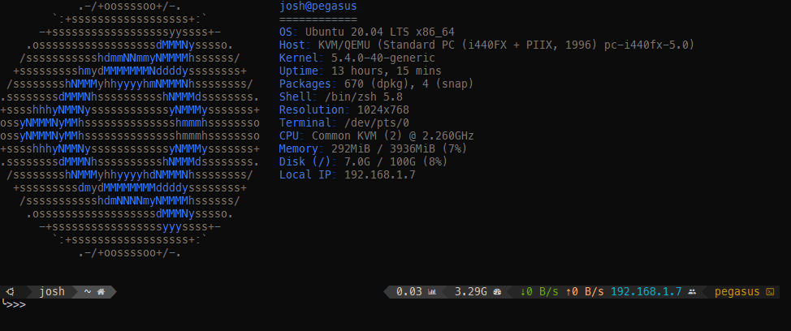

Oh-My-Zsh, Powerlevel10k, and Neofetch

[](https://travis-ci.com/LocalHappiness/ansible-zsh-p10k-role)
------------

Installs the following:
- [zsh](https://www.zsh.org/)
- [oh-my-zsh](https://ohmyz.sh/)
- [Powerlevel10k Theme](https://github.com/romkatv/powerlevel10k)
- [Solarized Color Theme](https://github.com/seebi/dircolors-solarized)
- [Neofetch](https://github.com/dylanaraps/neofetch)

This does not install fonts please install the font you would like to use:
[Meslo Nerd Font Patched](https://github.com/romkatv/powerlevel10k#meslo-nerd-font-patched-for-powerlevel10k)

Requirements
------------

Ubuntu >= 18.04

Role Variables
--------------
```yaml
#defaults/main
username: 
```
Dependencies
------------

This role install all dependencies such as (git and curl) 

Example Playbook
----------------

Including an example of how to use your role (for instance, with variables passed in as parameters) is always nice for users too:
```yaml
- hosts: localhost
  gather_facts: false
  become: true
  roles:
    - ansible-zsh-p10k-role
```

I also like to create tasks for specific inventory items such as:
```yaml
#Replace right-side prompt to indicate battery level for laptop
- name: Customizing .zshrc for {{ ansible.inventory_hostname }}
  become: yes
  lineinfile:
    dest: /home/{{ username }}/.zshrc
    regexp: "{{ item.regexp }}"
    line: "{{item.line}}"
    state: present
  with_items:
    - regexp: "^POWERLEVEL9K_RIGHT_PROMPT_ELEMENTS"
      line: "POWERLEVEL9K_RIGHT_PROMPT_ELEMENTS=(status battery ip host)"
```

```yaml
#Add aliases to the bottom of of .zshrc
- name: Copy aliases for ansible .zshrc
  lineinfile:
    path: /home/{{ username }}/.zshrc
    line: "{{ item.alias }}"
    create: yes
  loop:
    - {
        alias: 'alias hi="echo hello world!"',
      }
```
License
-------

MIT

Author Information
------------------

This was created by Joshua Herman [joshuaherman.tech](https://www.joshuaherman.tech).
